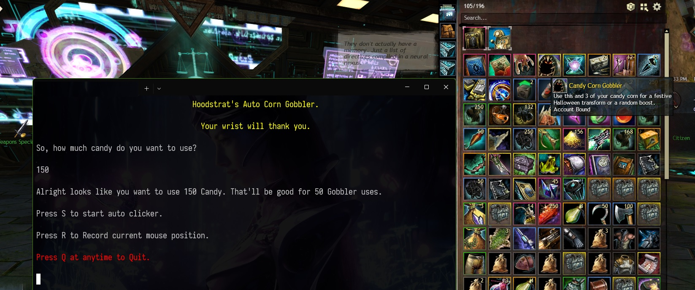

##### Simple Corn Gobbler Auto Clicker
---
This is a simple Auto Clicker specifically made with Guild Wars 2 in mind. Some of 
the program's short comings such as having to have your cursor on top of the item at 
all times were purposely put in place to stay within Guild Wars's TOS. 

https://help.guildwars2.com/hc/en-us/articles/360013762153-Policy-Macros-and-Macro-Use

###### Usage
---
- Download the latest release [Latest]()
- Open the program (small CLI program). It'll open up inside your default Windows
Terminal. Follow the onscreen instructions. 
- The cursor MUST be over the item you want to double click. 
	- the program will double click wherever the CURSOR IS PLACED so you can not
leave or alt tab from Guild Wars 2 (this is intentional to stay within the TOS)

###### Requirements
- **[>= .NETCore Version v3.1](https://dotnet.microsoft.com/en-us/download/dotnet/3.1)**

- **Currently only for Windows**

---

###### Screenshots

